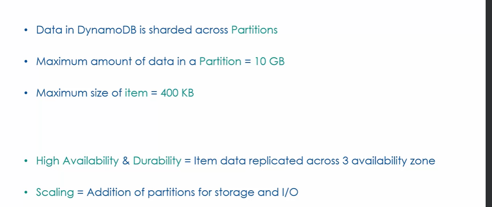
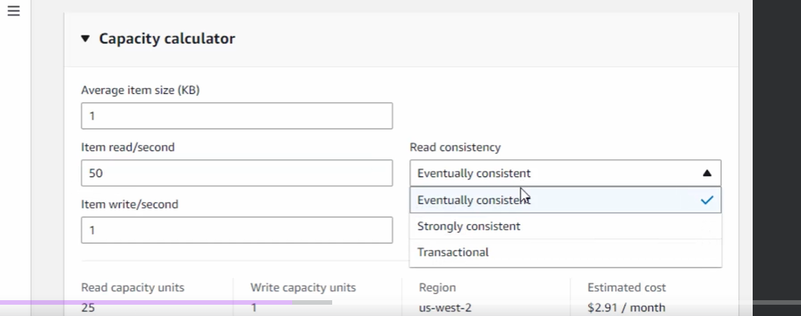
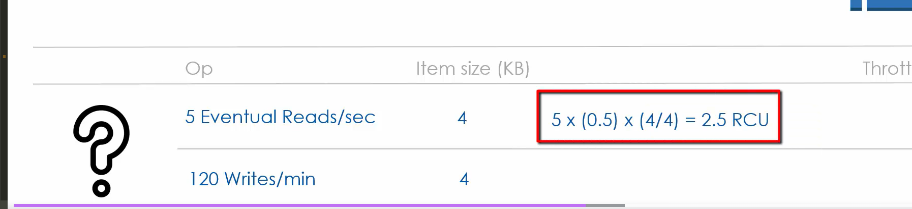
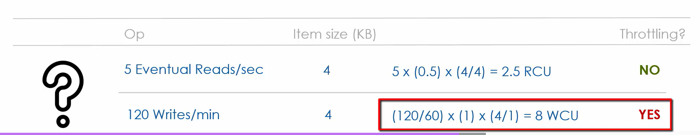

## Dynamo Runs on EC2
Dynamo behind the scenes is running on ec2 instances that we don't have to look at. It's managed by aws engineers.
There are hundreds of thousands of these instances (nodes) each Region. You might be concerned about dynamo capacity but you don't have to be. AWS engineers are consistently monitoring the available dynamodb capacity and adjusting it to meet the demands in the region

Nodes are spread across multiple AZs within the region. this leads to high availablility and Even if an entire AZ goes down, the nodes are still available in other AZs. 

How can my data still survive after an entire AZ goes down? Well your data is **SHARED** across multiple nodes in logical units called **PARTITIONS** (works like a shard in a normal db - sharding is not replicating the data it only spreads it out). Not only is data sharded, but your **data is replicated to nodes across 3 AZs** - that way a failure in one AZ or 2, your data is still available

**Every dynamo ec2 instance (node) hosts multiple dynamodb partitions**. These partitions can belong to multiple customers (I, customer A might can have partitions on a node for some of my tables that you, customer B might also have partitions on for one or more of your tables). Management of the ec2 instance nodes and partitions are abstracted away from you, the customer.

An **Item** in a partition has a key and a value. An item is identified by its key. The value of an item is like a `hashtable`. Can access Item using its key. The value in an item is referred to as an **Item Collection** (don't get confused - the value of an item is all the items that share a partition key. Value here does not refer to the attributes.)

As you write data to dynamo table, data is automatically sharded across partitions (and therefore across nodes - partitions are spread across nodes). Dynamo calculates the shard key by applying a HASH function to the partition key to determine which partitions to place the data on. 

The **items in an item collection are always located on the same partition** and for that reason the **size of item collection cannot exceed 10GB** since all items in item collection are on the same partition.

max item size is 400kb

Besides for partition storage limit of 10GB, there is also a limit on maximum number of I/O operations that can be carried out on a partition.
As the size of the table grows, dynamodb automatically adds partitions for you.

Question to think about - what happens when item collection inside partition exceeds max partition storage of 10GB? According to ChatGPT:

```
when an item collection in DynamoDB exceeds 10GB on a single partition, DynamoDB automatically splits the partition to distribute the data across additional partitions. This automatic partitioning helps manage data growth efficiently without manual intervention, maintaining the performance and availability of your DynamoDB tables.


```



## RRU, WRU, RCU, WCU

All KBs are rounded up to nearest multiple of 4KB

1 RRU (Read Request Unit) = 4KB Strongly consistent
.5 RRU = 4KB eventually consistent

So if you do a strongly consistent read of 5KB you are using 2RRU
5KB of eventually consistent reads is 1RRUw

(We'll talk about strongly consistent reads later but for now just know that strongly consistent reads gets latest data while eventually consistent data might be stale/outdated)

1 WRU (Write Request Unit) = 1 write of 1KB data

So if you write 1KB of data you use 1WRU
Write 1.5KB of data you use 2WRU


Read Capacity Unit (RCU) measures the read throughput . It's the max number of RRU that can be consumed per second
Write Capacity Unit (WCU) measures the write throughput - It's the max number of WRU that can be consumed per second

Each partition has maximum number of Read/Write requests it can handle per second

**Each partition has maximum of 3000 RCU** - this means 3000 stringly consistent reads of 4KB chunks per second (AKA 3000 RRU) or 6000 Eventually Consistent reads of 4KB chunks
**Each partition has maximum of 1000 WCU** - this means 1000 writes of 4KB chunks per second (AKA 3000 RRU) or 6000 Eventually Consistent reads of 4KB chunks

These RCU and WCU maximum values are fixed and cannot be changed

The maximum available I/O capacity of your table depends on the number of partitions you dynamo table has.
Say we have 4 partitions, then the maximum number of reads per second is 4 * 3000 RCU = 12,000 RCU = 12,000 Strongly consistent reads of 4KB chunks or 24,000 Eventually consistent reads of 4KB chunks
Maximum number of writes would then be 4 x 1000 WCU = 4000 WCU = 4000 writes of 1KB chunks per second

Keep in mind partitions are added as the table size and usage grows so the RCU and WCU constantly changes as table grows

## Storage Classes

2 storage classes in DynamoDB:
- Standard - Default class wih **25GB/Month free storage** but everything after that is .25 cents per GB of storage thereafter
- Standard-Infrequent Access (IA) - $.10 per GB per month but Read/WRite cost is higher compared to standard class 

## Pricing
2 things you're charged for
1. Amount of Storage
2. Number of READ and WRITE (and the size of data in those reads+writes)


Number of READ and WRITE is measured in RRU and WRU. Used for estimating cost of I/O against the table
Recall that RRU and WRU are rounded up 
RRU = number of 4KB chunk reads
WRU = number of 1KB chunk writes 

So a 5KB read is really 2 RRU
and a 2.4KB write is 3 WRU

```
WRU = $1.25 per million WRU
RRU = $0.25 per million RRU
```

This means that you'd have to write 1,000,000KB of data to be charged $1.25
and you'd have to read 4,000,000KB to be charged $0.25

Is it possible for cost to go to unacceptable levels? Yes! 
## Table Capacity Modes
CAn easily switch between capacity modes at any time. Just start with on demand and once you reach predictable level then switch to provisioned

1. On-Demand Capacity - Use as much capacity as you need. Pay as you go
2. Provisioned Capacity 
    - User specifies upper limit on RCU and WCU for the table and pay less for storage. e.g. you set 10RCU and 5WCU limit per second then you can only read 40KB per second and write 5KB per second
    - Capacity is distributed uniformly across all the partitions of your table - so in the case where your capacity is 10RCU, you can only read 40KB of data per second across all your partitions - sounds confusing but it's pretty simply you can only read 40KB of data per second regardless of which partition your requesting data from
    - You pay for the provisioned capacity whether you use it or not. Capacity is therfore cheaper


When creating dynamo table there is a capacity calculator. Here you specify average item size and number of item reads per second and you can see average cost




What happens if you exceed RCU/WCU (Known as **throttling** when you go above capacity and requests are rejected) you set in provisioned capacity. What happens is request gets rejected with 400 HTTP error

Note that throttling is only temporary - your table throttles because you reached the capacity of reads/writes in a single second so later it may work again when traffic requests to table decreases

Quiz: Will the below operations throttle on a table with 6RCU and 6WCU?


5 Eventual Reads of 4KB items = .5RRU per read * 5 = 2.5 RCU. This will not throttle becaquse 2.5RCU < 6RCU maxumum

120 writes/min of 4KB items = 120/60 seconds = 2 writes per second of 4KB items. 1 WRU = 1KB write of data. since we write 2*4KB per second that means we're using 4 WCU for each item write request and using 8 WCUs in a second which is over the limit of 6. This operation would throttle

