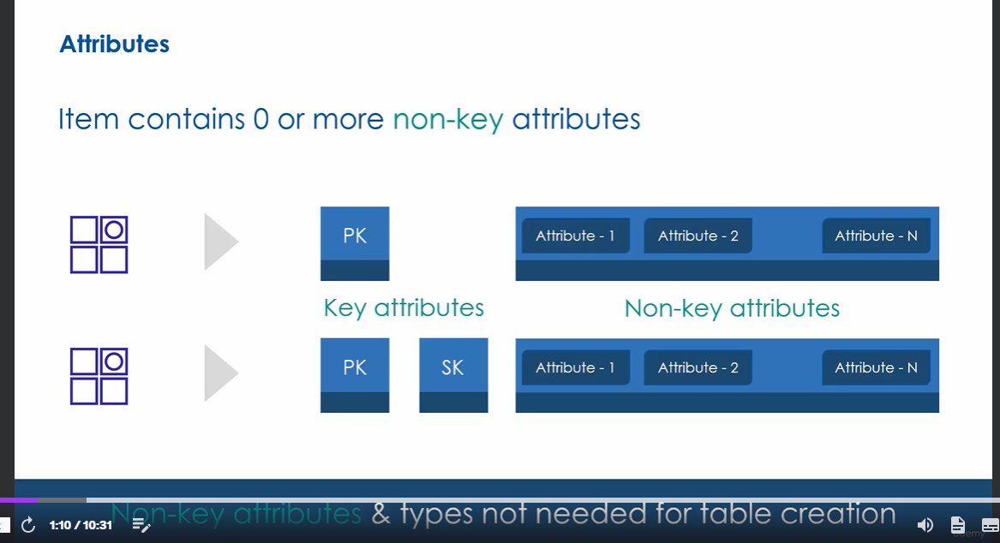
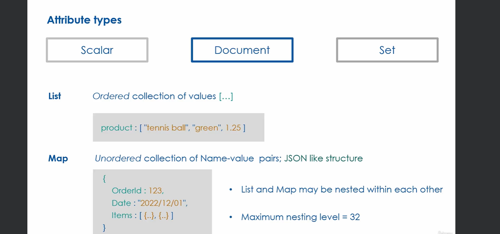
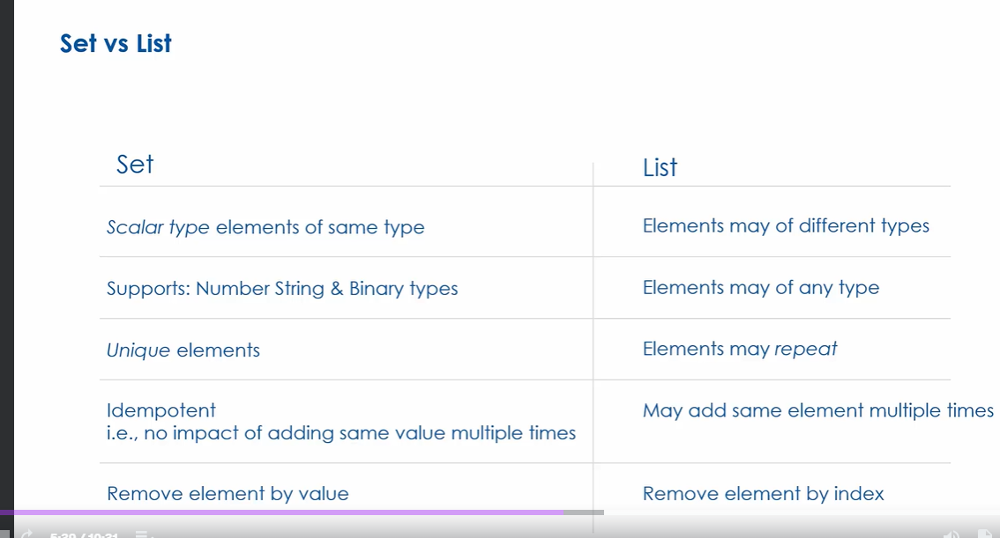
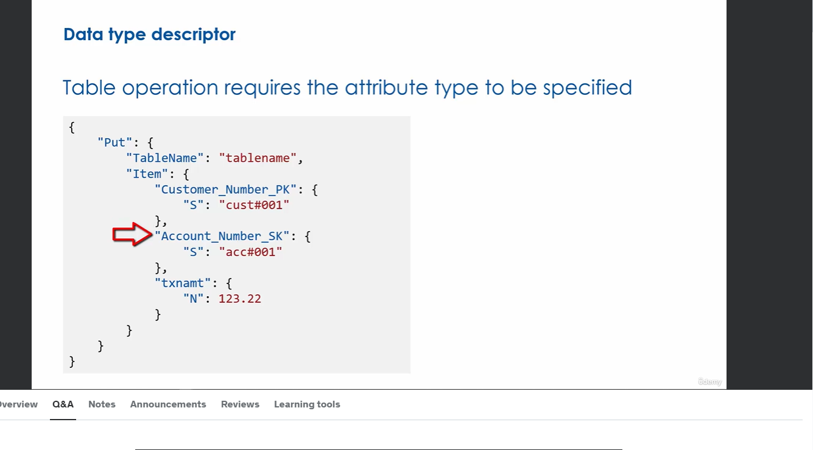

Table consists of partition key and optional sort key

Simple primary key is just partition key
Composite primary key is partition key + sort key

The primary key definition is known as the **key schema** and it must be defined when you create a table and cannot be changed during the table's lifetime. key schema is IMMUTABLE. Must give your key attributes names (in single table design good to simply use `PK` and `SK` for the key attribute names)

Max partition key size is 2048 bytes
Max sort key size is 1024 bytes

An item can contain 0 or more non-key attributes

DynamoDB is of course schemaless which is why you don't need to specify non-key attributes at the time of table creation (in relational dbs you must specify columns with their types at time of table creation).

## Attribute data types
- **Scalar** - scalar types have exactly  one value (string, number...). Key attributes (PK and SK) can only be specific scalar types (string, number or binary)
- **Document** - Document types are complex structures with nested attributes (objects)
- **Set** - Multiple scalar values (arrays)

## Scalar types
string
number - 38 digits of precision
binary - an unsigned byte array(good for images and other use cases...)
boolean - true or false
null - undefined state

## Document Types
list - ordered collection of values
map - Unordered collection of name-value pairs. Like JSON

List and map types may be nested within each other
**Max nesting level is 32**

## Set 
Set of scalar type values
All elements in the set must be the same
each element must be unique

3 types of sets supported by dynamodb
- string set - all elements are of type string
- number set - all elements are of type number
- binary set - all elements are of type binary

## List vs Set

So set is more restrictive of what you can store inside. All elements in set are unique and if you add duplicate element it simply won't be added since it exists in the set

## Table Operations Must Specify Attribute Type 

`S` = string
`N` = number
`B` = binary
`BOOL` = boolean
`NULL` = null
`M` = map
`L` = List
`NS` = Number set
`SS` = String set
`BS` = Binary Set

## No Date Type
No date type in Dynamo so how do we store and manage dates? 
use string or number

To use number, use Epoch timestamp (number of seconds that have passed since midnight of 1970 01/01/70)
there is a TTL (time to live) feature in dynamo that will automatically delete item after a certain date. We'll see this feature later but know that you use epoch to store the expiration for this
Numbers are also useful for mathematical calculations on date e.g. add 24 hours to date attribute

To use string, use ISO-8601 format - `YYY-MM-DD HH:mm:ss`
Storing dates as strings is useful for sorting - if you sort iso strings they will be in chronological order (good for sort keys)