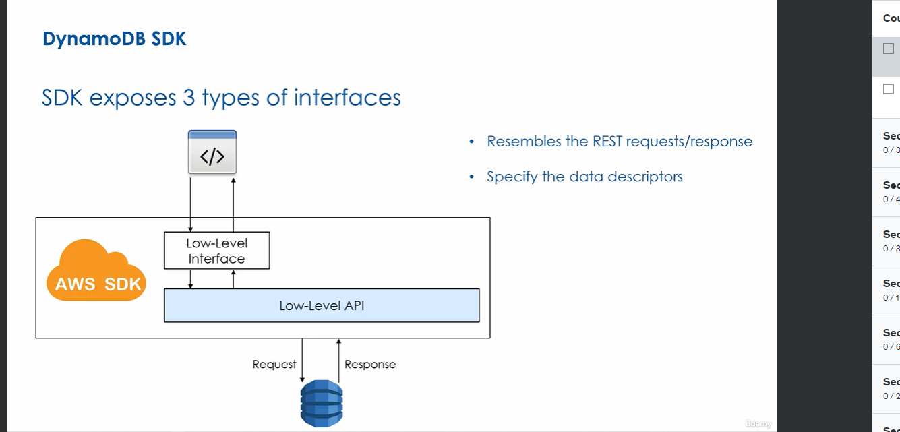
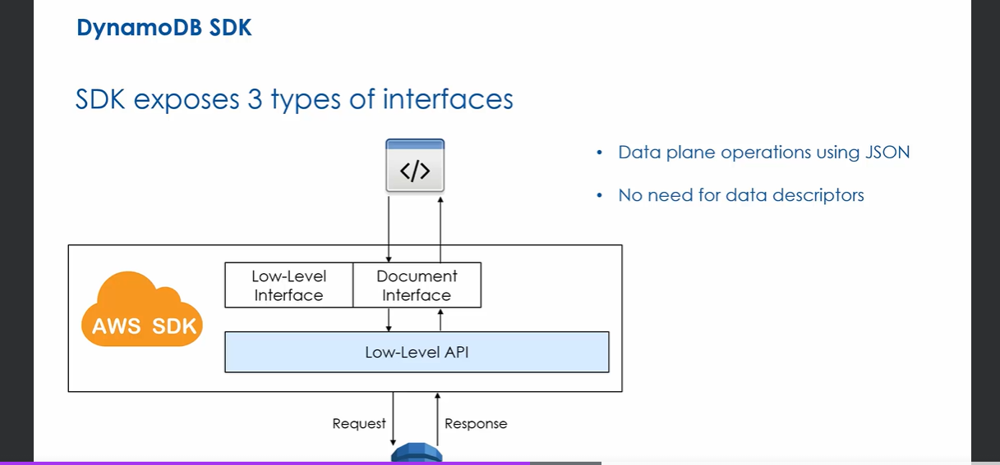

DyanoDB table operations fall into two categories:
- Control plane operations
    Used for managing tables, indexes, streams, capacity... e.g. create table, update table
    
    
- Data Plan operations
    Manipulate Items using CRUD actions e.g. create item, update item

Both types of operations can be called using AWS SDK/CLI...

DynamoDB uses JSON and REST over HTTP

The AWS CLI and management console use the DynamoDB SDK behind the scenes

SDK is available in many programming languages

The SDK exposes 3 types of interfaces:
- Low level interface

User of this interface must specify the data type (e.g. `{"name": {"S": "Tomer"}}`)

Example of low level interface using boto3 library in python:

As you can see we need the data descriptor

- Document Interface

Does not require developer to specify data types

- High level interface
