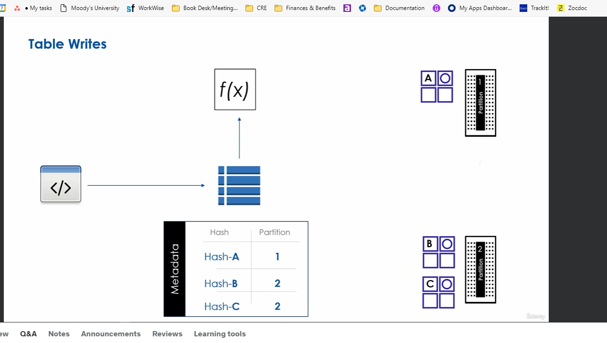
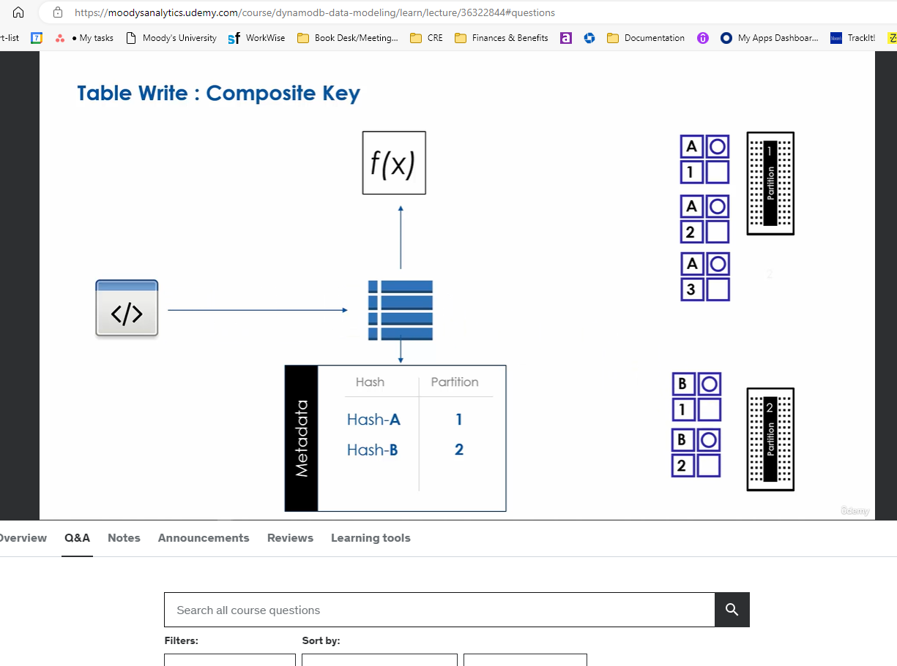
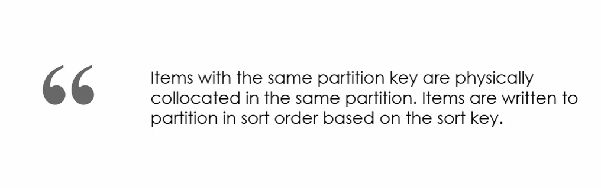
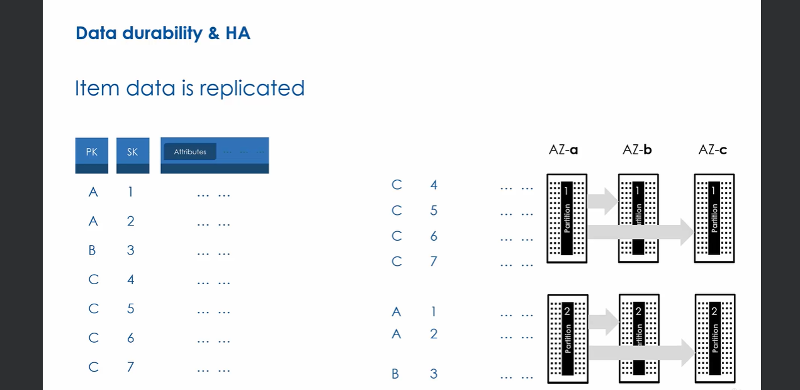
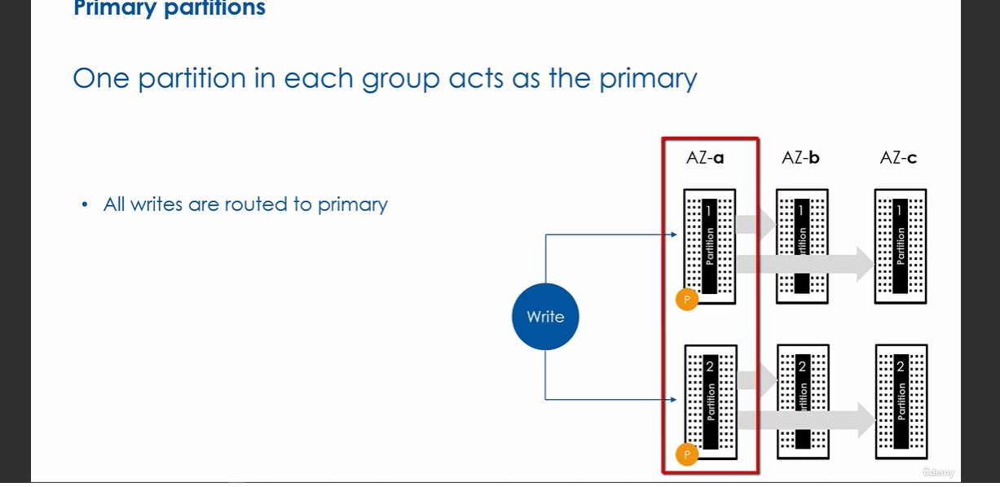
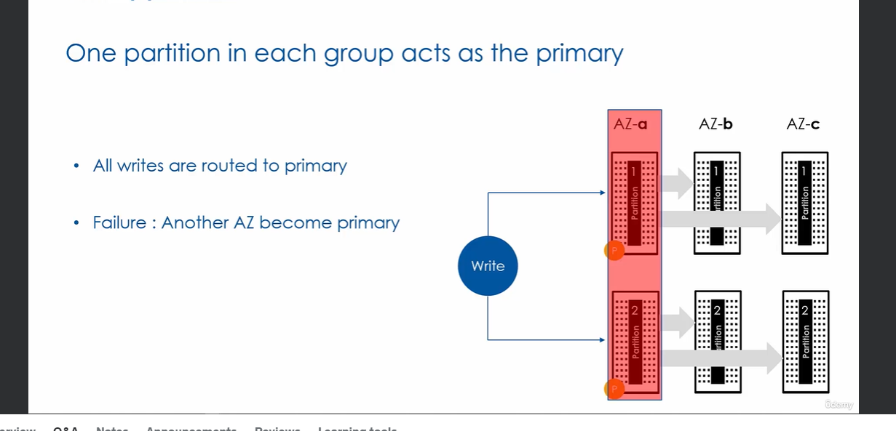
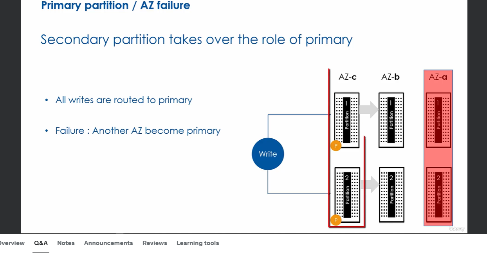
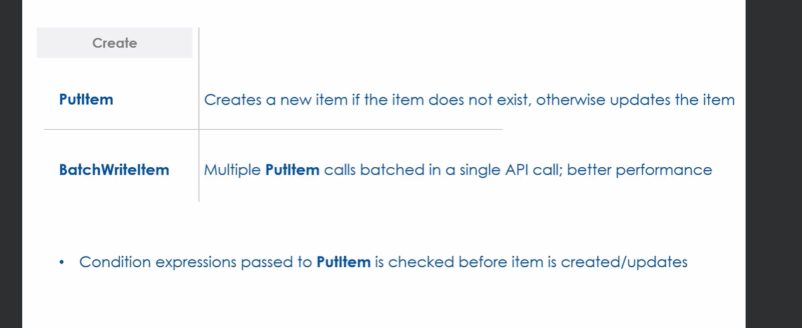

## Write; Under the Hood
Can write a single item in each request
Write operation is **atomic**. This means all attribute writes in the operation will either succeed or fail i.e. no partial writes
Requires the key-attributes (PK for simple key table or PK+SK for composite key table)

**Write will fail if item size is greater than 400KB**

## Simple Key Example

When you create dynamodb table, the table is created and there is metadata stored about the table along with it. The metadata inludes the key attributes and capacity, etc.
When you write item to DynamoDB table, DynamoDB applies the hash function on the partition key to determine which partition to write the item to. Based on the item's hash value (the result of applying the hash function to the partition key), dynamodb then decides the partition to which the data will get written. Once dynamodb determines which partition a particular item will be written to, it stores internally in the metadata the hash output to exact partition mapping. So say the hash function on PK results in hash key of "A" and items with hash key of "A" go into partition 1, then in the metadata for the table a mapping is created between Hash A and partition 1 so the table knows where all items with hash value of "A" live. This way when we read the data dynamo can quickly determine which partition data lives on



## Composite Key Example
This example, imagine the item with hash value of "A" but with sort key of 1. Now imagine another item is added with hash A and with sort key of 2. Dynamo checks the metadata table of hash to partition mappings and sees that items with hash value of A should belong on partition 1 so it gets sent to partition 1. Here's where it gets interesting - dynamo sorts items on partition by sort key value






## Data is Replicated for High Availablity and Durability


Think of the replicated partitions as a **partition group**. There are 3 partitions in the group. Each partition in the group lives in a different AZ and all 3 partitions that have the same **eventually consistent** data.

One partition in each group acts as the **Primary**. All writes are routed to the primary partition. IF the primary partition fails, another partitoin in another AZ becomes the primary



If there is an AZ failure in AZ-a. In this scenario one of the secondary partiitons will take over as primary



Now AZ-a partition replica will fall behind the other partitions when new items will be added while the AZ is down but our application will still be running and there will be no data loss!.
When AZ-a recovers, the partitions inside it will catch up with the primary and will eventually sync up


## Data Plane API for Creating Items (PutItem, BatchWriteItem)
To create an item, use **PutItem** action. Requires the partition key and the sort key if there is one in the table.

To insert multile items in one request, you can use `BatchWriteItem` command. 


## BatchWriteItem

Under the hood, this BatchWriteItem actually uses PutItem. The way it works is you may specify up to 25 Items in `BatchWriteItem` command to write to one or more tables. Dynamo processes each item by invoking `PutItem` with each item data. `BatchWriteItem` then returns JSON response and all failed writes are sent back to the application in an attribute called `UnprocessedItems`. Your app must then check the `UnprocessedItems` field and take appropriate action. 

It's important to keep in mind that `BatchWriteItem` is just multiple independent `PutItem` requests under the hood and failure of any of the `PutItem` requests will not impact other `PutItem` requests in the same `BatchWriteItem`

`BatchWriteItem` offers better performance compared to individual `PutItem` requests and avoids back and forth network requests between app and Dynamo

Later we'll see that `BatchWriteItem` can be used for batch deletes


## PutItem Default Behavior and Condition Expressions
By default, PutItem will update the item if it already exists. To determine if already exists, if the table has a simple primary key then it uses partition key to determine if exists and if composite key it uses both partition key and sort key

You may want operation to fail in the event that item exists instead of update the item. To do this we use `conditionExpression`

### Condition Expressions
A condition expression is a condition checked before item creation/update. This condition must be satisfied in order for the PutItem operation to succeed

Condition expression can be used with `PutItem`, `DeleteItem` and `UpdateItem`

Functions in condition expression:
- `attribute_exists`
- `attribute_not_exists`
- `attribute_type`
- `contains`
- `begins_with`
- `size`

Comparison operators in condition expression:
- `=`
- `<>`
- `<`
- `>`
- `<=`
- `>=`
- `BETWEEN`
- `IN`

Logical Operators in Condition expressions:
- `AND`
- `OR`
- `NOT`


To allow only create and not update if item exists, use `attribute_not_exists(PK)` where PK is the primary key attribute name. If the item you pass to PutItem's primary key value does not match any primary key in the table with attribute PK then the item does not exist in the table 

If condition expression fails, the `ConditionalCheckFailedException` is thrown, otherwise Item is created
Example
```bash
 aws dynamodb put-item --table-name "Employee" --item '{"LoginAlias": {"S": "irenes"}, "FirstName": {"S": "Irene"}, "LastName": {"S": "Smith"}, "ManagerLoginAlias": {"S": "mateoj"}, "Skills": {"SS": ["python", "aws"]}}' --condition-expression 'attribute_not_exists(LoginAlias)' --endpoint-url http://localhost:8000
```
If item with PK=irenes  exists we get
```bash
An error occurred (ConditionalCheckFailedException) when calling the PutItem operation: The conditional request failed
```

## Call Metrics
The Data Plane API allows you to provide parameters to control the response so you can get information about consumed capacity of a given request...

`ReturnConsumedCapcity` - `NONE` | `TOTAL` (Returns total capacity consumed by indexes) | `INDEXES` (Returns capacity consumed by indexes)
`ReturnCollectionMetrics` - `NONE` | `SIZE` (Returns statistics about item collection for item you just wrote)

```bash
$ aws dynamodb put-item --table-name "Students" --item '{"email": {"S": "tomer@gmail.com"}, "name": {"S": "Tomer"}, "courses": {"SS": ["Python", "Java"]}, "grade": {"S": "10"}}' --return-consumed-capacity TOTAL --return-item-collection-metrics SIZE --endpoint-url http://localhost:8000

{
    "ConsumedCapacity": {
        "TableName": "Students",
        "CapacityUnits": 1.0
    }
}

```
NOtice write capacity units used was 1 unit since the item was less than 1KB so and it rounds up and 1KB=1WRU
## Overview



