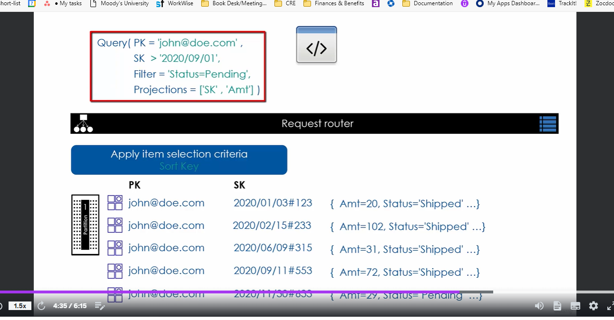

Maximum data returned by retrieve operations is restricted to 1 MB per call.
If the data exceeds this limit, the response will include only a portion of the data, along with a `LastEvaluatedKey` that can be used to fetch the next set of results (results are paginated - you'll need to make multiple requests to get more than 1MB of data).

Can use Projection to restrict attributes returned for items
Can use Filter to restrict the number of items returned

Note that 1MB retrieval limit applies before filters+projections 

We won't dive into projection and filter here but we'll dive into those later

## Strongly Consistent vs. Eventually Consistent
Items may be read from any partition in the **replication group**. Recall there are 3 partitions in replica group - one in each AZ. Since the data is always written to primary partition - a read from the primary partition will always return the latest data. This read from primary partition is referred to as **Strongly consistent read** as it would always return the latest data.

Reads can also be carried out from the standby partitions or replicas. Items read from these secondary partitions may not return the latest item data. This is due to the **replication lag** between primary partition and the secondary partitions. This type of read is referred to as **Eventually consistent read**. DynamoDB supports both strongly consistent and eventually consistent reads.


So basically - all writes are to primary partition of partition group
Strongly consistent reads are made to primary partition
Eventually consistent reads are from replica partitions. There may be a lag in writes to the replica partitions so you might get stale data in an eventually consistent read

Use eventually consistent reads wherever possible to save costs!


## 3 Ways to retrieve data
- Scan (Can get all items in table)
    like a SQL “SELECT * FROM table”
    Reads all items from all partitions in table
- GetItem (single item read by PK for simple primary key table or PK and SK for composite primary key)
    like a SELECT * from table with WHERE clause to select the item with a given partition key; in case of composite kye, single item read requires both the partition key and the sort key
- Query (gets an entire item collection by PK/SK)
    multiple item read query that returns an item collection based on a given partition key and a sort key selection criteria.


Let's dive into each read operation
### Scan
Reads all items from all partitions in table or in index. DynamoDB uses a single process to read all items from all partititons
The way it works is when you send a scan request, dynamo gets all items from one partition and returns it then retrieves all items on partition 2 and returns it and on and on until all partitions are read

For tables with a large number of items, performance is not good. For that reason Dynamo supports **parallel scan**.
A parallel scan reads items from N partitions in parallel. N is a number you specify. If N is 2 dynamo will launch 2 threads where each thread will run in parallel with others and retrieve data from a partition. This increases performance when running scan

### GetItem 
Requires the primary key specification so if it's a simple primary key table you must specify Partition key and if it's a composite primary key table you need to specify Partition Key and Sort Key

**By default, GetItem does eventually consistent reads**. Must explicitly define that you want strongly consistent if you want it

`BatchGetItem` is similar to `BatchWriteItem`. Under the hood it uses multiple `GetItem` calls. So say you request 100 items in the `BatchGetItem`, the dynamo servers will iterate over each item and call `GetItem`. Any item that it fails to get will be included in the response inside a `UnprocessedItems` attribute. Your app can then iterate over each `UnprocessedItems` and take appropriate action. Similar to `BatchWriteItem`, `BatchGetItem` offers better performance over multiple `GetItem`s

```bash
aws dynamodb get-item --table-name Employee --key '{"LoginAlias": {"S": "irenes"}}' --endpoint-url http://localhost:8000
```
```bash
aws dynamodb batch-get-item --table-name Employee --request-items file://../../DynamoDB-For-Architects/api/walkthrough-2-batch-get.json --endpoint-url http://localhost:8000
```
The batch-get-item command above we specify a file. We can pass it directly into the bash command but we used a file here to make it simple. Cheeckout the file to see how we pass the keys along with a ProjectionExpression to this batch get items

### Query
Requires the partition key. Optionally can specify sort key condition to filter item collection.
If you specify only partition key on table with pk and sk, then item collection is returned.

The expression used to specify the PK and/or the SK is called `KeyConditionExpression` 
### Item Count in Response
Both Scan and Query get item count in the response for the number of items that came along in response.
`ScannedCount` is the number of items read before filter criteria was applied and `Count` is number of items received by the application after the filter criteria applied

## Filter
Reduce returned items based on filters - filter can be applied to non-key attributes. 

note that the 1MB retrieval limit applies before the filter does!
The way it works is you submit Scan or Query request with a Filter and the items are read one by one and filter is applied to each item. If condition is satisfied by filter condition then item won't be returned in Scan/Query result 

## Request Router
Recall that DynamoDB maintains the “hash to partition mapping details” in the table’s metadata. In this illustration you see the mapping metadata and the distribution of items across 2 partitons.

When an application makes a Read/Update/Delete API call, the call goes to a **request router** component of the DynamoDB service. Router gets the mapping information from mapping metadata and then routes the call to the correct partition.


if a get item call is made for Partition Key for item A, the call will be directed to partition 1. For Item C the call will be directed to partition 2. This is the default behavior with eventual consistency for read operation. In case of request for strongly consistent read the calls are routed to the primary partitions.
In case of strongly consistent read, the GetItem request and therefore the request router will always route to primary replica

## Projections
used for restricting the number of attributes retrieved for an item. Application may provide ProjectionExpression to save on the network overhead. The expression may use placeholders for which the names are provided with ExpressionAttributeNames.

*Actual item size is used for calculating the consumed RRU. In other words, you will not save on IO cost by using projections so if the item you're requesting is 1kb and you make a projectionexpression request to only get back .5KB of data you're still charged for 1KB read but over the network you only get .5KB which will help with latency.

## Expression Atrribute Name + Expression Attribute Value
Parameters that improve readability of dynamodb expressions such as condition expressions and filter expressions

Expression attribute name is a placeholder you use in the expression. Prefix these names with `#`.
Expression attribute value is a placeholder that is substituded with the actual value. Prefixed with `:`

The purpose of Expression attribute name/value is to:
a. improve readability of expressions
b. allow you to use dynamo reserved keywords in filter and condition expression

Example:
```bash
aws dynamodb scan --table-name Employee --filter-expression 'ManagerLoginAlias = :myManagerAlias' --expression-attribute-values '{":myManagerAlias": {"S": "johns"}}' --endpoint-url http://localhost:8000
```
The above scan operation gets all employee items in Employee table with ManagerLoginAlias = "johns"
The response of the above command:
```
{
    "Items": [
        ...
    ],
    "Count": 4,
    "ScannedCount": 9,
    "ConsumedCapacity": null
}

```
Notice `ScannedCount` is 9 and count is 4. This is because dynamo read all 9 table items then applied filter expression. You will be charged for the 9 scanned items rather than the 4 `Count` items. If we omit filter expression we'd get back 9 items

Add `--return-consumed-capacity TOTAL` to above command to get back total RRU consumed by request. This value will reflect total RRU's used by the 9 scannedCount items. 

## Pagination
Scan and Query API paginates the result into pages <= 1MB in size. You'll know if the data you requested is paginated based on the presense of `LastEvaluatedKey`. In application check if this attribute exists and if it does and you want to retrieve all data you'll need to make another request and pass `LastEvaluatedKey`

## Limit Items
Can Limit the number of items in result set of Scan or Query with `Limit` parameter

## How multiple Item Reads Work Under the Hood
### Query
A relational query is very different from dynamo query

A relational query, you can specify any attribute in teh `where` clause. 
**In dynamo, you can only use key attributes(PK/SK) in the where clause.**

Partition key expression must be an equality check but sort key expressions can use a set of operations (`begins_with` for instance)
The expression used to query items is called `Key Condition Expression`


Let's walk through this query:

User requests Query for items where PK = "john@doe.com" and SK is greater than 2020/09/01. When request is initiated, the request hits the request router and request router routes the call to partition 1 since that's where the table metadata says hash key of "john@doe.com" items live. Request processing logic in the partition itself will apply the sort key selection criteria to fetch items where sort key is greater than 2020/09/01. In this example 2 items match that criteria so they will be returned


Let's go through another example, this time with filters and projection included


So in this case the request hits request router which forwards request to the appropriate partition based on the partition key specified. Item selection criteria is applied inside the partition so in this case the partition process will find all items where sort key is greater than date specified (2020/09/01). Once the items that match selection criteria are found, the filter will be applied, in this case items with status=pending will be returned while other items without status of pending will not. Finally projections applied and only the sort key and the Amt attribute will be returned (All these happen on the node of the partition inside the partition itself )


Sort key operators:


## Review


