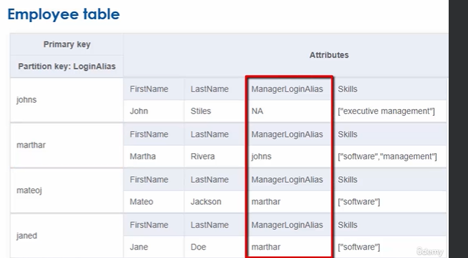
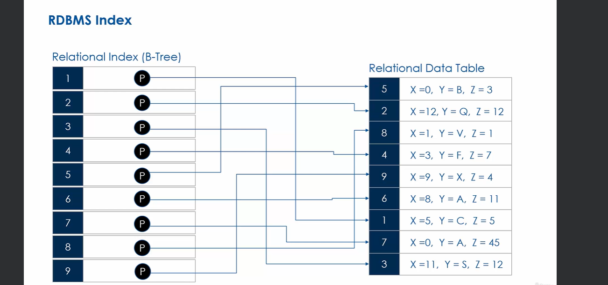
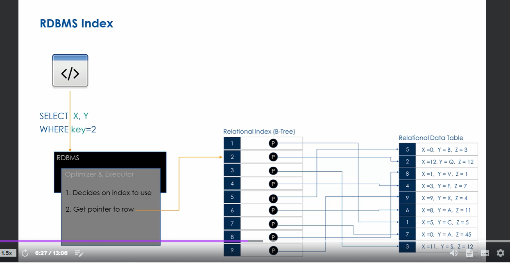
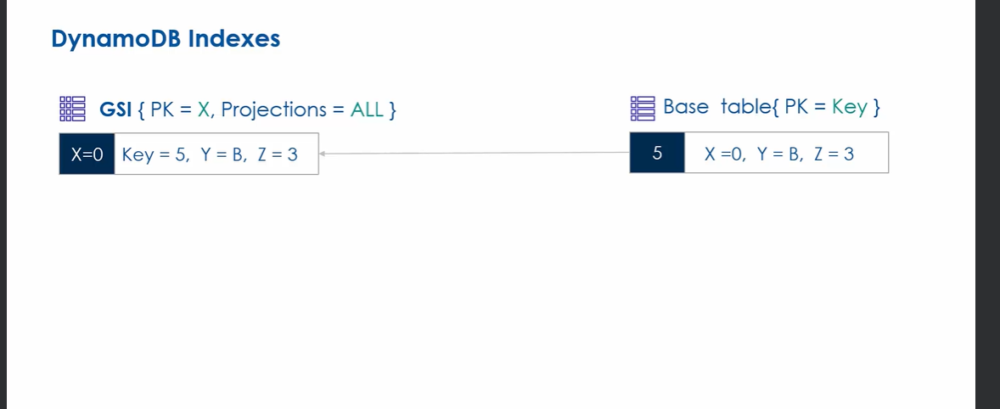
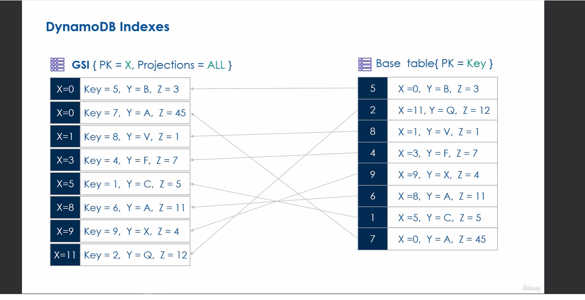
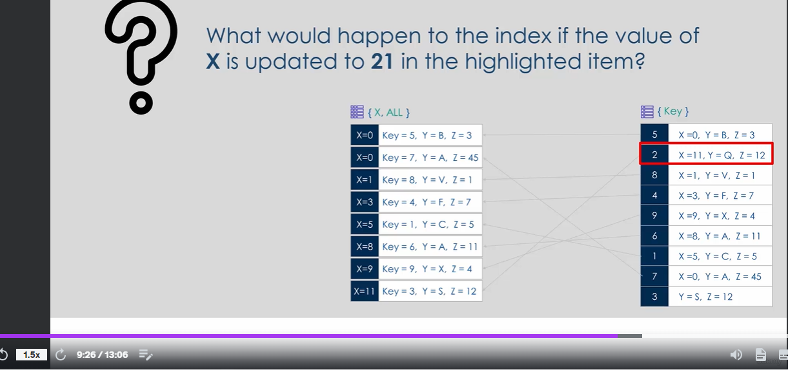
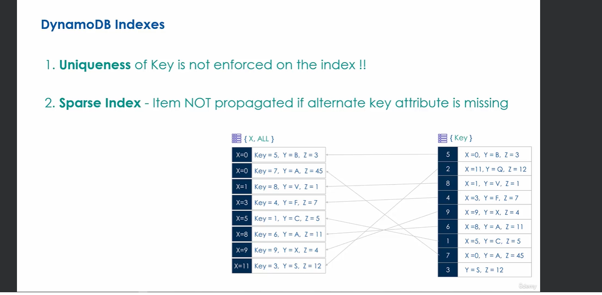
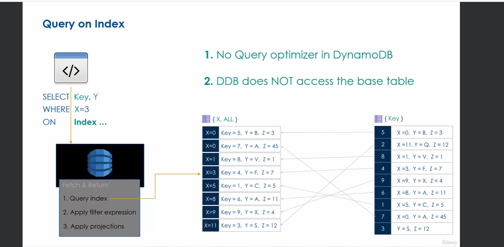
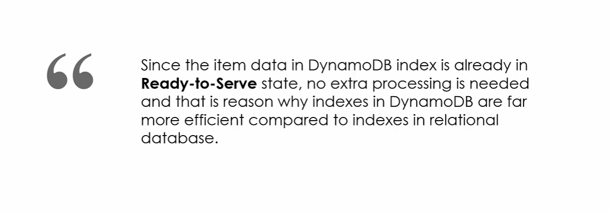

In the above table how would you find employees that report to `marthar`? This requires a table scan because we can't use primary key (Query and GetItem requeire key)

Using a scan is possible but highly inefficient in terms of performance and cost

`Indexing` provides a mechanism for making queries of non key attributes in table more efficient.

A `secondary index` is a data structure that contains subset of attributes from a table, along with an `alternate key` support for query operations. Indexes may then be `scanned` or `queried` like a table.
So for the example a above, we can create a secondary index and make the pk for this inde the ManagerLoginAlias attribute. This way we can efficiently get all employees that report to `marthar` by performing a fast query on index by PK

The `alternate key` of index can be any attribute form the table (key/non-key) - you can do a pk of a key on og table and an sk of a non-key attribute too. Anything is possible

2 types of secondary indexes:
- Local Secondary Index (LSI)
    Allows creation of alternate key in which PK is same as base table but you can use alternate SK. So a table with simple primary key cannot have LSI because there would be no point
    Local secondary indexes are created with the table. This means you cannot create LSI on an existing table and it must be created when table is created
- Global Secondary Index (GSI)
    PK / SK can be anything you want - it's fully customizable. MAy be created after table creation.

when defining secondary index, must specify key-schema (PK attribute/SK attribute) and projections (which attributes from base table do you want to include in secondary index so that when you query later it will come up).

Options for projections are `KEYS_ONLY`, `INCLUDE` (include specific attr only) and `ALL` (all attributes)

## Indexes in Relational Database
Relational dbs use a b-tree data structure for its indexes. THe index in RDBs serve same purpose as dynamo index but under the hood it's a bit different

THis is how RDB uses indexes - You choose a column to index and RDB will create the b-tree structure that sorts the column in order that makes querying index efficient then it stores along with the sorted column a pointer to the database row. 

Now when you send query to this database, the db engine uses an optimizer to process query. Optimizer creates a query plan and decides on an index to use if there are any. It then gets the pointer to the row from the index it's looking for

## Indexes in Dynamo
Base table with `PK` key attribute. Non-key attributes are x,y,z
We create GSI where the PK is going to be the x attribute. We set projection = `ALL`
When item is written to base table, dynamodb service will automatically  write item record to the GSI we created and the PK it sets there is the value of the item's x attribute. It also stores the `PK` key attribute value from base table but as a non-key attribute in GSI

Note in the picture above we have 2 records in GSI with PK of X=0. Note that in a simple key table with only a PK, you can't have 2 items with same PK however this is possible in an index. Dynamo does not enforce uniqueness of keys in indexes, only in tables! For this reason you can't call `GetItem` on dynamodb indexes and you must use SCAN or QUERY only. Because GetItem uses the key to look up item and expects one item returned but in this case we'd get many

What happens if we add item to base table without attribute x (the pk of our GSI). What would happen?? 
THe item simply does not get writen to GSI!

DynamoDB always ensures Base Table is in sync with GSI! So if you update any attribute in base table or delete, the item will be updated/deleted in GSI
If you just delete the attribute x in base table from our example above, that item will be removed entirely from index since it's the PK of our index

In the above exampel what happens if item in base table with attribute x=11 gets updated to x=21. Once updated in base table, The item with pk x=11 in index first gets deleted since x attribute changed in base table, then a new one is created in index with pk x=21 

## How to retrieve items from index?
Unlike RDB we don't have this query optimizer that automatically optimizes queries by looking in index.
We, the developer need to optimize queries ourselves and know when to use index and when we want specify the index we want to query. You want to make sure to project all the values you need in index so that all the data you need is in index - no need to access base table at all after checking index

## Additional things to note about secondary indexes in dynamo
- SIs use same storage class & capacity mode as base table automatically
- Name of index MUST be unique at table level
    Use LSI-<index-name> or GSI-<index-name>
    When fetching from index, you must specify the base table as well as the index name is not globally unique rather it's unique at the table level
- Key schema of index must be top-level attributes (not nested) of type String, Number or Binary
- Indexes get deleted if table is deleted
- Index updates are automatic but **costs WCU** 